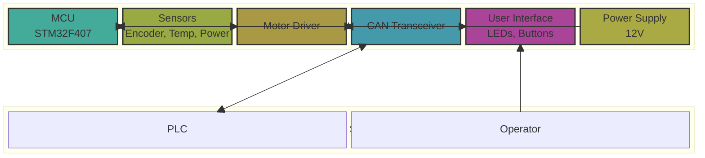
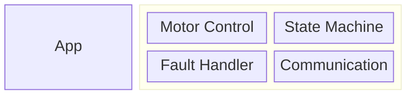

# System Architecture Document (SAD)

## 1. Overview
### 1.1 Purpose
This document describes the system architecture of [Project Name], including hardware and software components, their interactions, and design decisions.

**Example:**
- Define the overall system structure and component relationships
- Establish hardware-software boundaries
- Provide architecture-level design decisions
- Serve as reference for detailed design documents

### 1.2 Scope
This document covers:
- System-level architecture (hardware and software)
- Hardware components and interfaces
- Software architecture overview (detailed design in SW-ARCH)
- Communication architecture
- Safety and reliability mechanisms

**Out of Scope:**
- Detailed software module design (see SW-ARCH)
- Detailed interface specifications (see InterfaceSpec)
- Implementation details

### 1.3 References
- [Software Requirements Specification](10_SRS.md)
- [Software Architecture Design](21_SW-ARCH.md)
- [Interface Specification](40_InterfaceSpec.md)
- STM32F407xx Datasheet
- FreeRTOS Reference Manual

## 2. System Architecture
### 2.1 System Overview
The [Project Name] is an embedded control system that [brief description].

**Example:**
The motor control system consists of:
- **MCU**: STM32F407VG microcontroller running at 168 MHz
- **Sensors**: Quadrature encoder, temperature sensor, power supply monitor
- **Actuators**: PWM-controlled motor driver
- **Communication**: CAN bus transceiver, UART for debug
- **User Interface**: Status LEDs, optional display, push buttons

The system operates in a real-time environment, processing control loops at 1 kHz and communicating with external devices via CAN bus.

### 2.2 System Block Diagram


### 2.3 Key Components
**Example:**
- **MCU (STM32F407VG)**
  - ARM Cortex-M4 core @ 168 MHz
  - 1 MB Flash, 192 KB SRAM
  - Multiple timers, ADC, CAN, UART, I2C, SPI peripherals
  
- **Motor Driver**
  - PWM input: 0-3.3V, 20 kHz
  - Direction control: Digital I/O
  - Current feedback: Analog input
  
- **Quadrature Encoder**
  - A/B channels, 5V tolerant inputs
  - Resolution: 1000 pulses/revolution
  - Maximum speed: 3000 RPM
  
- **Temperature Sensor**
  - I2C digital sensor (LM75 compatible)
  - Range: -40°C to +125°C
  - Accuracy: ±2°C
  
- **CAN Transceiver**
  - ISO 11898-2 compliant
  - Supports 125 kbps to 1 Mbps
  - 5V tolerant CANH/CANL

## 3. Hardware Architecture
### 3.1 MCU/Processor
**Example:**
- **Part Number**: STM32F407VGT6
- **Core**: ARM Cortex-M4F with FPU
- **Clock**: 
  - System clock: 168 MHz (from PLL)
  - AHB: 168 MHz
  - APB1: 42 MHz
  - APB2: 84 MHz
- **Voltage**: 1.8V - 3.6V (typically 3.3V)
- **Package**: LQFP100

### 3.2 Memory Configuration
**Example:**
- **Flash Memory (1 MB)**
  - Bootloader: 0x08000000 - 0x08007FFF (32 KB)
  - Application: 0x08008000 - 0x080FFFFF (960 KB)
  - Configuration: 0x080F8000 - 0x080FFFFF (32 KB, last sector)
  
- **SRAM (192 KB)**
  - Stack: Top 8 KB reserved
  - Heap: 16 KB for dynamic allocation
  - Application data: Remaining ~168 KB
  
- **Memory Map:**
```
0x20000000 - 0x2002FFFF: SRAM (192 KB)
0x08000000 - 0x080FFFFF: Flash (1 MB)
0x40000000 - 0x5FFFFFFF: Peripheral registers
```

### 3.3 Peripherals
**Example:**
- **Timers**
  - TIM1: Motor PWM generation (20 kHz, center-aligned)
  - TIM2: Encoder interface (quadrature mode)
  - TIM3: Control loop timer (1 kHz interrupt)
  - TIM4: Watchdog timer (500 ms timeout)
  
- **ADC**
  - ADC1: Power supply monitoring (channel 0)
  - ADC2: Motor current feedback (channel 1)
  - Resolution: 12-bit
  - Sampling rate: 1 kHz
  
- **Communication**
  - CAN1: CAN bus communication (500 kbps)
  - UART1: Debug console (115200 baud)
  - UART2: Firmware update (115200 baud)
  - I2C1: Temperature sensor (400 kHz)
  
- **GPIO**
  - Emergency stop input (active low, interrupt capable)
  - Status LEDs (4 outputs)
  - Start/Stop button (with debounce)

### 3.4 Power Management
**Example:**
- **Power Supply**
  - Input: 12V ±10% (10.8V - 13.2V)
  - On-board regulator: 3.3V @ 500mA
  - Power consumption: ~200mA @ 3.3V typical
  
- **Power Management Features**
  - Brown-out detection: 9V threshold
  - Power-on reset: Hardware POR circuit
  - Low-power modes: Sleep mode for idle periods
  - Power sequencing: Controlled startup sequence

## 4. Software Architecture
### 4.1 Software Layer Structure
**Example:**


### 4.2 Key Modules
**Example:**
- **Application Modules**
  - `motor_control`: PID control, speed regulation
  - `state_machine`: System state management
  - `fault_handler`: Fault detection and recovery
  - `communication`: CAN message handling
  
- **Driver Modules**
  - `encoder_driver`: Quadrature encoder interface
  - `temp_sensor_driver`: I2C temperature sensor
  - `motor_driver`: PWM generation and control
  - `can_driver`: CAN bus communication
  
- **BSP Modules**
  - `pin_config`: Pin multiplexing configuration
  - `clock_config`: System clock setup
  - `board_init`: Board-specific initialization

### 4.3 Data Flow
**Example:**
```
Sensor Data Flow:
Encoder → TIM2 → encoder_driver → motor_control → PWM (TIM1) → Motor

Command Flow:
CAN Bus → can_driver → communication → state_machine → motor_control

Temperature Monitoring:
I2C Sensor → temp_sensor_driver → fault_handler → state_machine
```

## 5. Communication Architecture
### 5.1 Communication Protocols
**Example:**
- **CAN Bus (Primary)**
  - Protocol: CAN 2.0B (extended frame)
  - Baud rate: 500 kbps (configurable)
  - Message format: 29-bit ID, 8-byte data
  - Error handling: Automatic retransmission, error counters
  
- **UART (Debug/Update)**
  - Protocol: Asynchronous serial
  - Baud rate: 115200, 8N1
  - Usage: Debug logging, firmware update
  
- **I2C (Sensors)**
  - Protocol: I2C
  - Speed: 400 kHz (fast mode)
  - Usage: Temperature sensor communication

### 5.2 Interface Definitions
**Example:**
- **CAN Message IDs**
  - 0x18XX XXXX: Commands to controller (received)
  - 0x19XX XXXX: Status from controller (transmitted)
  - 0x1AXX XXXX: Diagnostic messages
  
- **UART Commands**
  - ASCII-based command protocol
  - Commands: `STATUS`, `CONFIG`, `RESET`, `UPDATE`
  
- **I2C Addresses**
  - Temperature sensor: 0x48 (7-bit address)

## 6. Safety and Reliability
### 6.1 Error Handling
**Example:**
- **Error Detection**
  - Watchdog timer: 500 ms timeout, independent watchdog (IWDG)
  - Sensor failure detection: Timeout on sensor communication
  - Communication errors: CAN error counters, UART framing errors
  - Memory protection: MPU for stack overflow detection
  
- **Error Recovery**
  - Automatic recovery: Retry sensor communication (3 attempts)
  - Graceful degradation: Reduce functionality on non-critical errors
  - Safe shutdown: Emergency stop on critical errors
  
- **Error Reporting**
  - Fault codes: 16-bit fault code register
  - CAN diagnostic messages: Transmit fault codes periodically
  - Logging: Store fault events in non-volatile memory

### 6.2 Safety Mechanisms
**Example:**
- **Hardware Safety**
  - Emergency stop: Hardware interrupt, immediate motor shutdown
  - Watchdog: Independent hardware watchdog (cannot be disabled)
  - Brown-out protection: Hardware BOR circuit
  
- **Software Safety**
  - Task monitoring: Monitor critical task execution
  - Stack overflow protection: MPU-based stack guard
  - Assertions: Runtime checks for critical conditions
  - Safe state: Defined safe state for all error conditions
  
- **Redundancy**
  - Dual sensor reading: Temperature sensor read twice for validation
  - Command validation: Verify CAN commands before execution
  - Configuration checksum: CRC32 for configuration data integrity
