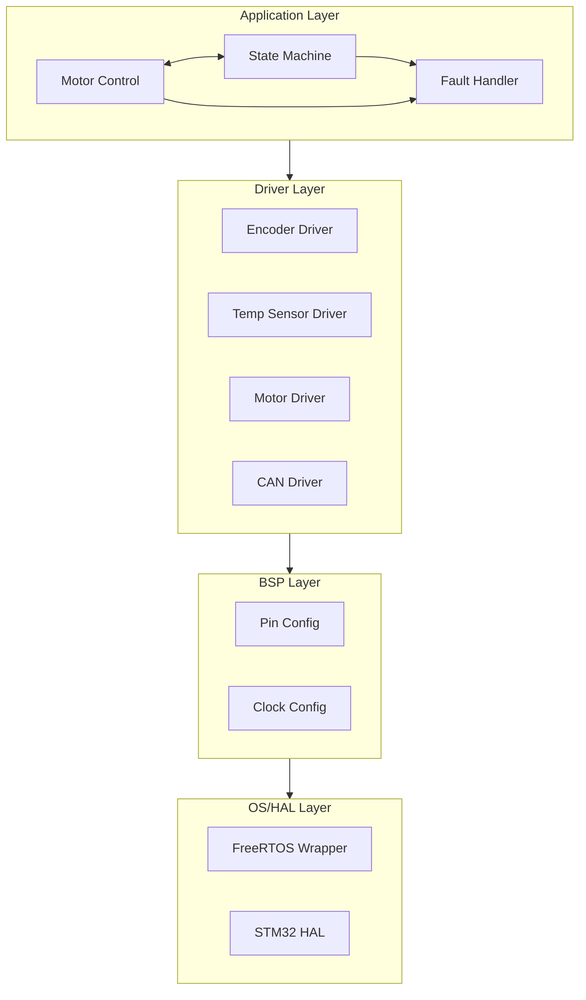
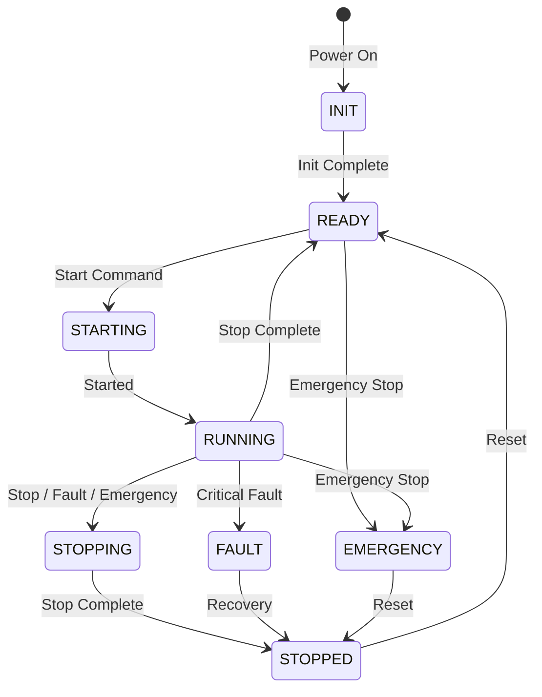

# Software Architecture Design (SW-ARCH)

## 1. Overview
### 1.1 Purpose
This document describes the detailed software architecture, including module design, interfaces, data structures, and implementation guidelines.

**Example:**
- Define software module structure and responsibilities
- Specify inter-module interfaces and APIs
- Establish design patterns and coding standards
- Provide implementation guidelines for developers

### 1.2 Scope
This document covers:
- Software layer structure and module organization
- Detailed module design
- Data structures and message formats
- Interface specifications (APIs, callbacks)
- State machine design
- Memory management strategy
- Task scheduling and timing

**Out of Scope:**
- Hardware-specific details (see SAD)
- Interface protocol details (see InterfaceSpec)
- Test implementation (see TestPlan)

### 1.3 Architecture Principles
**Example:**
- **Layered Architecture**: Strict layer separation, no cross-layer calls
- **Modularity**: High cohesion, low coupling between modules
- **Abstraction**: Hardware abstraction through HAL and BSP layers
- **Real-time**: Deterministic execution, bounded response times
- **Safety**: Fail-safe design, error detection and recovery
- **Maintainability**: Clear interfaces, comprehensive documentation

## 2. Software Structure
### 2.1 Layer Structure
#### 2.1.1 Application Layer
**Location**: `firmware/app/`

**Responsibilities:**
- High-level application logic
- System state machine
- Business logic and control algorithms
- Coordination between modules

**Example Modules:**
- `motor_control.c/h`: PID control, speed regulation
- `state_machine.c/h`: System state management
- `fault_handler.c/h`: Fault detection and handling
- `communication.c/h`: CAN message processing

**Dependencies:**
- Driver Layer (sensor data, actuator control)
- OS Layer (tasks, timers, queues)

#### 2.1.2 Driver Layer
**Location**: `firmware/drivers/`

**Responsibilities:**
- Device driver implementations
- Sensor/actuator interface abstraction
- Protocol implementations (CAN, I2C, etc.)

**Example Modules:**
- `encoder_driver.c/h`: Quadrature encoder interface
- `temp_sensor_driver.c/h`: I2C temperature sensor driver
- `motor_driver.c/h`: PWM motor control
- `can_driver.c/h`: CAN bus driver

**Dependencies:**
- BSP Layer (GPIO, timer, peripheral configuration)
- OS Layer (interrupts, mutexes)

#### 2.1.3 BSP Layer
**Location**: `firmware/bsp/`

**Responsibilities:**
- Board-specific configuration
- Pin multiplexing
- Clock configuration
- Peripheral initialization

**Example Modules:**
- `pin_config.c/h`: Pin assignment and configuration
- `clock_config.c/h`: System clock setup
- `board_init.c/h`: Board initialization sequence
- `peripheral_init.c/h`: Peripheral setup

**Dependencies:**
- HAL Layer (STM32 HAL library)

#### 2.1.4 OS/HAL Layer
**Location**: `firmware/os/`, STM32 HAL

**Responsibilities:**
- RTOS abstraction (FreeRTOS wrapper)
- Hardware abstraction (STM32 HAL)
- Low-level hardware access

**Example Modules:**
- `os_wrapper.c/h`: FreeRTOS task/queue/timer wrappers
- `hal_wrapper.c/h`: STM32 HAL function wrappers
- `interrupt_handler.c/h`: Interrupt service routines

## 2.2 Module Structure
**Example Directory Structure:**
```
firmware/
├── app/
│   ├── motor_control.c/h
│   ├── state_machine.c/h
│   ├── fault_handler.c/h
│   └── communication.c/h
├── drivers/
│   ├── encoder_driver.c/h
│   ├── temp_sensor_driver.c/h
│   ├── motor_driver.c/h
│   └── can_driver.c/h
├── bsp/
│   ├── pin_config.c/h
│   ├── clock_config.c/h
│   └── board_init.c/h
├── os/
│   ├── os_wrapper.c/h
│   └── interrupt_handler.c/h
└── config/
    ├── config.h
    └── feature_flags.h
```

### 2.3 Component Diagram
**Example:**


## 3. Key Module Design
### 3.1 Application Module
**Example: Motor Control Module**

**File**: `firmware/app/motor_control.c/h`

**Responsibilities:**
- PID control algorithm implementation
- Speed regulation
- Motor start/stop control

**Key Functions:**
```c
// Initialize motor control module
void MotorControl_Init(void);

// Set target speed (RPM)
void MotorControl_SetTargetSpeed(uint16_t rpm);

// Get current speed (RPM)
uint16_t MotorControl_GetCurrentSpeed(void);

// Update control loop (called at 1 kHz)
void MotorControl_Update(void);

// Get PID parameters
void MotorControl_GetPIDParams(float *kp, float *ki, float *kd);

// Set PID parameters
void MotorControl_SetPIDParams(float kp, float ki, float kd);
```

**Data Structures:**
```c
typedef struct {
    float kp;
    float ki;
    float kd;
    float integral;
    float prev_error;
    uint16_t target_speed;
    uint16_t current_speed;
} MotorControl_t;
```

### 3.2 Driver Module
**Example: Encoder Driver Module**

**File**: `firmware/drivers/encoder_driver.c/h`

**Responsibilities:**
- Read quadrature encoder position
- Calculate speed from position
- Handle encoder overflow/underflow

**Key Functions:**
```c
// Initialize encoder driver
void EncoderDriver_Init(void);

// Get current position (counts)
int32_t EncoderDriver_GetPosition(void);

// Get speed (RPM)
uint16_t EncoderDriver_GetSpeed(void);

// Reset encoder position
void EncoderDriver_Reset(void);
```

**Data Structures:**
```c
typedef struct {
    int32_t position;
    int32_t prev_position;
    uint32_t last_update_time;
    uint16_t speed_rpm;
} EncoderDriver_t;
```

### 3.3 BSP Module
**Example: Pin Configuration Module**

**File**: `firmware/bsp/pin_config.c/h`

**Responsibilities:**
- Pin multiplexing configuration
- GPIO initialization
- Pin function assignment

**Key Functions:**
```c
// Configure all pins
void PinConfig_Init(void);

// Configure specific pin
void PinConfig_ConfigurePin(uint32_t pin, uint32_t mode, uint32_t pull);
```

**Example Pin Assignments:**
```c
// Motor PWM
#define MOTOR_PWM_PIN        GPIO_PIN_8
#define MOTOR_PWM_PORT       GPIOA
#define MOTOR_PWM_TIMER      TIM1

// Encoder
#define ENCODER_A_PIN        GPIO_PIN_0
#define ENCODER_B_PIN        GPIO_PIN_1
#define ENCODER_PORT         GPIOA

// CAN
#define CAN_TX_PIN           GPIO_PIN_12
#define CAN_RX_PIN           GPIO_PIN_11
#define CAN_PORT             GPIOA
```

### 3.4 OS Wrapper Module
**Example: FreeRTOS Wrapper**

**File**: `firmware/os/os_wrapper.c/h`

**Responsibilities:**
- Abstract FreeRTOS functions
- Provide simplified API
- Handle OS-specific details

**Key Functions:**
```c
// Create task
osTaskHandle_t OS_CreateTask(const char *name, 
                             void (*task_func)(void *),
                             uint32_t stack_size,
                             uint8_t priority);

// Create queue
osQueueHandle_t OS_CreateQueue(uint32_t queue_length, uint32_t item_size);

// Send to queue
bool OS_QueueSend(osQueueHandle_t queue, void *item, uint32_t timeout_ms);

// Create timer
osTimerHandle_t OS_CreateTimer(const char *name,
                               void (*callback)(void *),
                               uint32_t period_ms,
                               bool auto_reload);
```

## 4. Data Structures
### 4.1 Key Data Types
**Example:**
```c
// Motor control data
typedef struct {
    float kp, ki, kd;
    float integral;
    float prev_error;
    uint16_t target_speed;
    uint16_t current_speed;
    bool enabled;
} MotorControlData_t;

// System status
typedef enum {
    SYSTEM_STATE_INIT,
    SYSTEM_STATE_READY,
    SYSTEM_STATE_RUNNING,
    SYSTEM_STATE_FAULT,
    SYSTEM_STATE_STOPPED
} SystemState_t;

// Fault codes
typedef enum {
    FAULT_NONE = 0,
    FAULT_OVERTEMP = 0x0001,
    FAULT_ENCODER_ERROR = 0x0002,
    FAULT_COMMUNICATION = 0x0004,
    FAULT_WATCHDOG = 0x0008
} FaultCode_t;
```

### 4.2 Message Structure
**Example: CAN Message Structure**
```c
// CAN command message (received)
typedef struct {
    uint8_t command;        // 0: Stop, 1: Start, 2: Set Speed
    uint16_t target_speed;  // Target speed in RPM
    uint8_t reserved[5];
} CAN_CommandMsg_t;

// CAN status message (transmitted)
typedef struct {
    uint8_t state;         // System state
    uint16_t current_speed; // Current speed in RPM
    uint16_t temperature;   // Temperature in 0.1°C
    uint16_t fault_code;    // Fault code
    uint8_t reserved[2];
} CAN_StatusMsg_t;
```

### 4.3 Configuration Data
**Example:**
```c
// System configuration (stored in Flash)
typedef struct {
    uint32_t magic_number;      // 0xDEADBEEF
    float pid_kp;
    float pid_ki;
    float pid_kd;
    uint16_t temp_warning_threshold;  // 0.1°C units
    uint16_t temp_critical_threshold; // 0.1°C units
    uint32_t can_baudrate;      // bps
    uint16_t watchdog_timeout;  // ms
    uint32_t crc32;             // Checksum
} SystemConfig_t;
```

## 5. Interface Design
### 5.1 Inter-Module Interfaces
**Example: Motor Control ↔ Encoder Driver Interface**

```c
// Encoder driver provides:
uint16_t EncoderDriver_GetSpeed(void);

// Motor control uses:
current_speed = EncoderDriver_GetSpeed();
```

**Example: Communication ↔ State Machine Interface**

```c
// Communication module provides:
void Communication_SendStatus(CAN_StatusMsg_t *msg);

// State machine uses:
CAN_StatusMsg_t status;
status.state = StateMachine_GetCurrentState();
Communication_SendStatus(&status);
```

### 5.2 API Definitions
**Example: Motor Control API**

```c
// Public API (in motor_control.h)
void MotorControl_Init(void);
void MotorControl_SetTargetSpeed(uint16_t rpm);
uint16_t MotorControl_GetCurrentSpeed(void);
void MotorControl_Update(void);
void MotorControl_Enable(void);
void MotorControl_Disable(void);

// Private functions (in motor_control.c, not in header)
static void MotorControl_UpdatePID(void);
static void MotorControl_ApplyOutput(float output);
```

### 5.3 Callback Functions
**Example:**
```c
// Timer callback for control loop
void ControlLoop_TimerCallback(void *arg) {
    MotorControl_Update();
}

// CAN receive callback
void CAN_RxCallback(uint32_t can_id, uint8_t *data, uint8_t length) {
    if (can_id == CAN_CMD_ID) {
        CAN_CommandMsg_t *cmd = (CAN_CommandMsg_t *)data;
        StateMachine_HandleCommand(cmd);
    }
}

// Emergency stop interrupt callback
void EmergencyStop_ISR(void) {
    StateMachine_TriggerEmergencyStop();
}
```

## 6. State Machine
### 6.1 System States
**Example:**
```c
typedef enum {
    STATE_INIT,        // Initialization
    STATE_READY,       // Ready to start
    STATE_STARTING,    // Motor starting
    STATE_RUNNING,     // Normal operation
    STATE_STOPPING,    // Motor stopping
    STATE_STOPPED,     // Stopped
    STATE_FAULT,       // Fault condition
    STATE_EMERGENCY    // Emergency stop
} SystemState_t;
```

**State Descriptions:**
- **INIT**: System booting, initializing peripherals
- **READY**: Initialization complete, waiting for start command
- **STARTING**: Motor ramp-up phase
- **RUNNING**: Normal operation, control loop active
- **STOPPING**: Motor ramp-down phase
- **STOPPED**: Motor stopped, system ready
- **FAULT**: Error detected, safe state
- **EMERGENCY**: Emergency stop activated

### 6.2 State Transition Diagram
**Example:**


## 7. Memory Management
### 7.1 Memory Map
**Example:**
```
Flash (1 MB):
  0x08000000 - 0x08007FFF: Bootloader (32 KB)
  0x08008000 - 0x080F7FFF: Application (960 KB)
  0x080F8000 - 0x080FFFFF: Configuration (32 KB, last sector)

SRAM (192 KB):
  0x20000000 - 0x20001FFF: Stack (8 KB, top of RAM)
  0x20002000 - 0x20005FFF: Heap (16 KB)
  0x20006000 - 0x2002FFFF: Application data (~168 KB)
  
Memory Regions:
  - Static variables: .data, .bss sections
  - Stack: Top 8 KB (grows downward)
  - Heap: 16 KB for dynamic allocation
  - Task stacks: Allocated from application data area
```

### 7.2 Dynamic Memory Allocation
**Example:**
- **Heap Size**: 16 KB
- **Allocator**: FreeRTOS heap_4 (best-fit algorithm)
- **Usage Guidelines**:
  - Avoid dynamic allocation in real-time tasks
  - Prefer static allocation for critical data
  - Use dynamic allocation only for initialization
  - Monitor heap usage (FreeRTOS provides API)

**Example Usage:**
```c
// Allowed: During initialization
void Init_AllocateBuffers(void) {
    buffer = pvPortMalloc(BUFFER_SIZE);
}

// Avoid: In real-time control loop
void ControlLoop_Update(void) {
    // DON'T: data = malloc(...);  // Too slow, non-deterministic
    // DO: Use pre-allocated static buffer
}
```

### 7.3 Stack/Heap Management
**Example:**
- **Stack Sizes**:
  - Main task: 2 KB
  - Control loop task: 1 KB
  - Communication task: 1.5 KB
  - Total: ~5 KB (leaves 3 KB margin)

- **Stack Monitoring**:
  - FreeRTOS stack watermark monitoring
  - Check stack usage periodically
  - Alert if usage > 80%

- **Heap Monitoring**:
  - Use `xPortGetFreeHeapSize()` to monitor
  - Log heap usage in debug builds
  - Alert if free heap < 2 KB

## 8. Timing and Scheduling
### 8.1 Task Structure
**Example:**
```c
// Control loop task (1 kHz)
void Task_ControlLoop(void *arg) {
    TickType_t last_wake_time = xTaskGetTickCount();
    const TickType_t period = pdMS_TO_TICKS(1); // 1 ms
    
    while (1) {
        MotorControl_Update();
        vTaskDelayUntil(&last_wake_time, period);
    }
}

// Communication task (10 Hz)
void Task_Communication(void *arg) {
    TickType_t last_wake_time = xTaskGetTickCount();
    const TickType_t period = pdMS_TO_TICKS(100); // 100 ms
    
    while (1) {
        Communication_ProcessMessages();
        Communication_SendStatus();
        vTaskDelayUntil(&last_wake_time, period);
    }
}

// State machine task (event-driven)
void Task_StateMachine(void *arg) {
    while (1) {
        StateMachine_ProcessEvents();
        vTaskDelay(pdMS_TO_TICKS(10));
    }
}
```

### 8.2 Priorities
**Example:**
```c
// Task priorities (higher number = higher priority)
#define TASK_PRIORITY_CRITICAL     (configMAX_PRIORITIES - 1)  // 7
#define TASK_PRIORITY_HIGH         (configMAX_PRIORITIES - 2)  // 6
#define TASK_PRIORITY_NORMAL       (configMAX_PRIORITIES - 3)  // 5
#define TASK_PRIORITY_LOW          (configMAX_PRIORITIES - 4)  // 4

// Task assignments
Task_ControlLoop:      TASK_PRIORITY_CRITICAL  // Real-time control
Task_EmergencyStop:    TASK_PRIORITY_CRITICAL  // Safety critical
Task_StateMachine:     TASK_PRIORITY_HIGH      // System coordination
Task_Communication:    TASK_PRIORITY_NORMAL    // Communication
Task_Diagnostics:      TASK_PRIORITY_LOW       // Non-critical
```

### 8.3 Timing Constraints
**Example:**
- **Control Loop**: 
  - Period: 1 ms (1000 Hz)
  - Maximum execution time: 500 μs
  - Jitter tolerance: ±50 μs
  
- **CAN Communication**:
  - Status message period: 100 ms
  - Command response time: ≤ 10 ms
  - Maximum message processing time: 5 ms
  
- **Temperature Monitoring**:
  - Update period: 100 ms
  - Maximum read time: 10 ms
  
- **Watchdog**:
  - Timeout: 500 ms
  - Refresh period: 200 ms (safety margin)

**Timing Verification:**
- Use FreeRTOS run-time stats to verify execution times
- Monitor task execution times in debug builds
- Ensure worst-case execution time (WCET) < deadline
